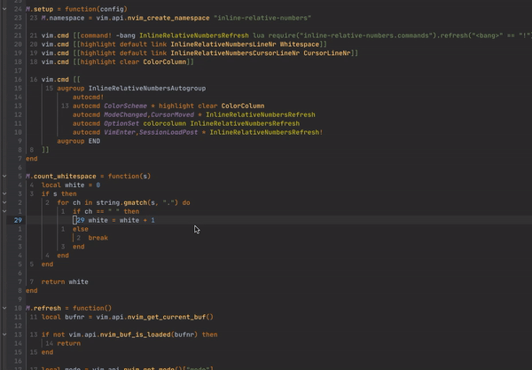

## Inline Relative Numbers

This plugin was born out of the necessity to have relative line numbers closers to the code lines,

so it would be easier and faster to eye scan and jump to the correct line.

### Setup with Lazy

``
{
"gvlatko/inline-relative-numbers.nvim",
config = function() require("inline-relative-numbers").setup {} end,
event = "BufRead",
},

``

Credit to [https://github.com/lukas-reineke/virt-column.nvim](https://github.com/lukas-reineke/virt-column.nvim)
